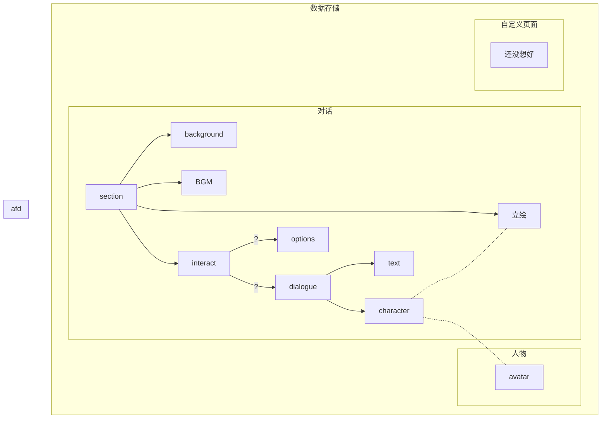

### 剧本处理
 - 书写格式和运行时在内存中的存储格式不同
 - 分为不同的section以便不同的选项跳转
	- 大的分歧点分为不同section
	- 小的分歧可以考虑直接内嵌脚本解决
 - 命令由反斜杠开头
 - 背景、bgm和说话的人物由命令切换
 - 文本支持分句、换行、换页
	- 以行为单位，分句或者每条命令占一行
	- 换行和换页由命令实现
	- 加入语法糖，如换行的命令为空一行
 - 支持嵌入脚本
	- 单行：\script
	- 多行：\beginscript、\endscript
 - 选项和section都有uuid，每个section和每组选项分开存储
	- k/v数据库？
		- leveldb？
 - 选项由命令处理
 - 后端处理还是前端处理？
	- 后端吧~~反正都是我一个人写~~，前端放映就好了吧

### 存档
 - 由后端处理，但前端也能获取，这样就可能可以兼容web版？
 - 要保存选项，还有自定义数据